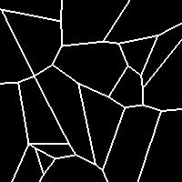
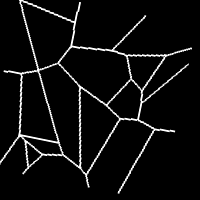
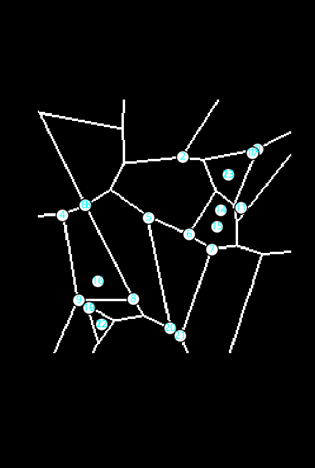
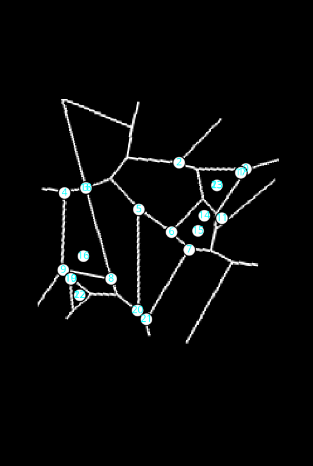

# skimage-sift-registration

Simple plugin for 2D keypoint detection and affine registration with RANSAC.

----------------------------------

Artificial data 

Moving and fixed images showing inlier keypoints after RANSAC

----------------------------------

This [napari] plugin was generated with [Cookiecutter] using [@napari]'s [cookiecutter-napari-plugin] template.
It uses the [scikit-image] SIFT keypoint detection routines to find distinctive image points and generate local descriptions of the image around them.
Correspondences between the two images are then found by looking for pairs of keypoints, one in each of the two images, with closely matching descriptors.

For typical images, many of these correspondences will be wrong. To reduce these false correspondences, the plugin applies the RANSAC algorithm. This randomly selects a small subset of the matching pairs of keypoints, estimates the affine transformation between this subset of keypoints, and then evaluates how many of the other pairs of keypoints also closely agree with this affine transformation ("inliers"). A large number of random samples are tested, and the transformation with the most inliers retained.

The plugin outputs two points layers, one for each image, containing all the corresponding SIFT keypoints betwee the . It also uses the estimated affine transformation between the two images to deform the "moving" image layer onto the "fixed" image layer.

This approach is an attempt to provide similar functionality to the Stephan Saalfeld's Fiji "Extract SIFT Correspondences" plugin [extract], and more-or-less
just provides a napari interface to the existing routines in scikit-image. There are great examples in the scikit-image documentation (e.g. [SIFT-example] and [RANSAC-example]) that can be used if you would like to use these routines in your own analysis scripts.

## Installation

You can install `napari-sift-registration` via [pip]:

    pip install napari-sift-registration

To install the latest development version :

    pip install git+https://github.com/jfozard/napari-sift-registration.git

## Usage

### Basic usage

- Load two 2D single channel images in Napari.
- Select the menu item Plugins > napari-sift-registration
- Select these two images as the "Moving image layer" and the "Fixed image layer". The moving image will be deformed by the transformation to look like the fixed image.
- The remaining parameters are the default settings from scikit-image; try these default values first.

### Advanced usage

The parameter values for SIFT feature detection, keypoint matching and RANSAC are accessible from the plugin gui. For further information about their use, see the appropriate scikit-image documentation:

Upsampling before feature detection, maximum number of octaves, maximum number of scales in every octave, blur level of seed image, feature descriptor size, feature descriptor orientation bins: see [scikit-image-SIFT].

Closest/next closest ratio: see [scikit-image-match_descriptors]

Minimum number of points sampled for each RANSAC model, distance for points to be inliers in RANSAC model, maximum number of trials in RANSAC model: see [scikit-image-RANSAC]

Only show inlier keypoints: If checked, only show corresponding keypoints that are inliers after RANSAC. If unchecked, show all corresponding keypoints.

### Limitations

Only 2D, single channel images (for now).

## Contributing

Contributions are very welcome. Tests can be run with [tox], please ensure
the coverage at least stays the same before you submit a pull request.

## License

Distributed under the terms of the [BSD-3] license,
"napari-sift-registration" is free and open source software

## Issues

If you encounter any problems, please [file an issue] along with a detailed description.

[extract]: https://imagej.net/plugins/feature-extraction
[scikit-image]: https://scikit-image.org/
[SIFT-example]: https://scikit-image.org/docs/stable/auto_examples/features_detection/plot_sift.html
[RANSAC-example]: https://scikit-image.org/docs/stable/auto_examples/transform/plot_matching.html
[napari]: https://github.com/napari/napari
[Cookiecutter]: https://github.com/audreyr/cookiecutter
[@napari]: https://github.com/napari
[MIT]: http://opensource.org/licenses/MIT
[BSD-3]: http://opensource.org/licenses/BSD-3-Clause
[GNU GPL v3.0]: http://www.gnu.org/licenses/gpl-3.0.txt
[GNU LGPL v3.0]: http://www.gnu.org/licenses/lgpl-3.0.txt
[Apache Software License 2.0]: http://www.apache.org/licenses/LICENSE-2.0
[Mozilla Public License 2.0]: https://www.mozilla.org/media/MPL/2.0/index.txt
[cookiecutter-napari-plugin]: https://github.com/napari/cookiecutter-napari-plugin

[scikit-image-SIFT]: https://scikit-image.org/docs/stable/api/skimage.feature.html#skimage.feature.SIFT
[scikit-image-match_descriptors]: https://scikit-image.org/docs/stable/api/skimage.feature.html#skimage.feature.match_descriptors
[scikit-image-RANSAC]: https://scikit-image.org/docs/stable/api/skimage.measure.html#skimage.measure.ransac

[file an issue]: https://github.com/jfozard/napari-sift-registration/issues

[napari]: https://github.com/napari/napari
[tox]: https://tox.readthedocs.io/en/latest/
[pip]: https://pypi.org/project/pip/
[PyPI]: https://pypi.org/
